# AIOps-Agent

知识库 + 运维多 Agent 协作系统。技术栈：Python + RAG + LangGraph + Kafka + Neo4j + Milvus + Redis Stack。

## 目录

1. [系统概述](#1-系统概述)
2. [核心技术栈](#2-核心技术栈)
3. [整体架构](#3-整体架构)
4. [核心 API](#4-核心-api)
5. [核心功能设计](#5-核心功能设计)
   - 5.1 [事件驱动多 Agent 协作](#51-事件驱动多-agent-协作)
   - 5.2 [自适应 RAG 检索](#52-自适应-rag-检索)
   - 5.3 [短期记忆与长期记忆](#53-短期记忆与长期记忆)
   - 5.4 [监控告警](#54-监控告警)
   - 5.5 [根因分析](#55-根因分析)
   - 5.6 [故障自愈](#56-故障自愈)
   - 5.7 [高可用保障](#57-高可用保障)
   - 5.8 [质量评估](#58-质量评估)
6. [关键时序流程](#6-关键时序流程)
7. [非功能设计](#7-非功能设计)
8. [快速开始](#8-快速开始)
9. [测试](#9-测试)
10. [评估](#10-评估)

---

## 1. 系统概述

本系统面向芯片缺陷检测业务，将「知识问答」「对话交互」「运维排障」三类原本割裂的能力整合为同一套智能体平台。业务痛点在于：芯片缺陷系统涉及多个微服务（检测 API、鉴权、数据库代理、推理 Worker 等），问题定位链路长，既需要从海量文档和工单中快速获取历史经验，也需要在指标或日志异常时自动进行故障归因与处置。传统做法是"知识库一套系统、监控一套系统、运维手册又一套"，问题发生时人工在多个系统之间切换串联信息，效率低、也难以沉淀。

本系统通过事件驱动的多 Agent 协作，把上述能力串成一条自动化流水线。用户的自然语言提问可以命中知识库 RAG 检索给出答案，并可以结合历史对话与用户画像做个性化回复；系统主动采集的指标异常或日志错误会沉淀为告警事件，驱动根因分析 Agent 基于微服务拓扑图谱与知识检索给出根因，再交给自愈 Agent 执行预设运行手册。整个过程端到端有 `trace_id` 贯穿，所有阶段都会落下评估轨迹，便于离线回放与质量评估。

系统的设计目标有三：**一是显著缩短故障定位时间**，让 SRE 专注决策而非信息收集；**二是沉淀知识闭环**，让每一次告警与处置的过程结构化地回流到知识库；**三是做到"可观测、可评估、可插拔"**，在检索、生成、根因等关键节点都具备数据可观测性，允许替换底层组件（如更换 Embedding 模型、切换向量库）而不影响整体架构。

---

## 2. 核心技术栈

系统主语言为 **Python**，围绕异步 I/O 展开，所有外部调用（LLM、向量库、图库、消息队列）均使用 `async`/`await`。LLM 能力通过LangChain封装，多 Agent 的状态机和分支控制通过LangGraph表达，使 QA 的"加载记忆 → 分类 → 检索 → 生成 → 更新记忆"流程可在一张有向图里显式声明。服务入口采用 FastAPI，对外提供 REST 与 SSE 流式接口。

在数据底座上，**Kafka** 承担异步事件总线，为 5 个 Agent 之间的请求/响应/告警提供解耦和重放能力；Milvus负责知识向量与用户画像向量的存储与 ANN 检索；Neo4j承担微服务拓扑知识图谱，用 Cypher 快速查询告警服务的上下游；Redis Stack同时扮演两个角色——既是短期对话记忆的 KV 存储，也是语义缓存的 HNSW 向量索引（依赖 RediSearch）。

嵌入与重排使用bge-m3与bge-reranker-v2-m3，均支持中英双语并在中文语料上效果稳定；BM25 通路使用 `rank-bm25` 配合 `jieba` 分词，用于对日志关键字类查询做精准字面匹配。评估环节接入RAGAS，覆盖 faithfulness、answer relevancy、context precision、context recall 四项标准检索-生成指标。高可用部分做差异化重试，配合自研的三态熔断器。配置通过YAML覆盖，日志通过 **loguru** 的 `contextualize` 把 `trace_id` 注入到每条日志中。

基础设施统一以 **Docker Compose** 编排，开发者一条命令即可拉起完整依赖环境。

---

## 3. 整体架构

系统由两个平面构成：**控制平面**是 FastAPI Gateway，接收用户对话请求与外部告警 Webhook；**数据/执行平面**是 5 个 Agent，通过 Kafka 事件总线解耦协作。

```
                 ┌─────────────────────────────────────────┐
                 │           FastAPI Gateway                │
                 │    /chat   /alert   /health              │
                 └───────┬────────────────────┬─────────────┘
                         │                    │
                         ▼                    ▼
              ┌──────────────────┐  ┌──────────────────────┐
              │    QA Agent      │  │   Monitor Agent       │
              │ (LangGraph DAG)  │  │  (3-sigma/EWMA/regex) │
              └────────┬─────────┘  └──────────┬───────────┘
                       │ publish               │ publish
                       ▼                       ▼
              ┌─────────────────────────────────────────────┐
              │              Kafka Event Bus                 │
              │ qa.request • rag.request • alert.raw •       │
              │ rca.result • heal.request • eval.trace       │
              └──────┬────────────┬────────────┬────────────┘
                     ▼            ▼            ▼
             ┌───────────┐  ┌──────────┐  ┌───────────┐
             │ RAG Agent │  │ RCA Agent│  │ Heal Agent│
             └──┬────┬───┘  └────┬─────┘  └─────┬─────┘
                │    │           │              │
          ┌─────┘    └────┐      │              │
          ▼               ▼      ▼              ▼
     ┌────────┐     ┌────────┐ ┌─────┐    ┌───────────┐
     │ Milvus │     │ BM25 + │ │Neo4j│    │ Runbooks  │
     │ Vector │     │ jieba  │ └─────┘    │ (YAML)    │
     └────────┘     └────────┘            └───────────┘
                    │
                    └──► Redis Stack (语义缓存 + 短期记忆)
```

每个 Agent 独立订阅自己关心的 Topic，使用各自的 `group.id` 保证横向扩容时的分区负载均衡。消息 Key 使用 `trace_id`，同一 trace 的后续消息因此落入同一分区，保证顺序性。QA Agent 是一个 LangGraph 编译出的状态机；RAG / RCA / Heal 是单一职责的消息处理者；Monitor 是主动轮询型生产者，没有入口 Topic。

数据流有两条主干。**问答主流程**：用户请求进入 Gateway，内部调用 QA Agent，在 LangGraph 内部同步完成记忆加载、意图分类、RAG 检索、LLM 生成、记忆更新五步；对外以 JSON 或 SSE 流式返回。**运维主流程**：Monitor Agent 采集指标/扫描日志 → 发布 `alert.raw` → RCA Agent 消费并调用拓扑 + RAG + LLM 做根因 → 发布 `rca.result` 与 `heal.request` → Heal Agent 消费并执行对应 Runbook。

---

## 4. 核心 API

### 4.1 对话 `POST /chat`

请求体为用户会话信息与查询：

```json
{
  "session_id": "sess-abc",
  "user_id": "alice",
  "query": "chip-api CPU 飙高要看什么?",
  "stream": false
}
```

非流式响应返回 `QAResponse`，包含答案与检索依据：

```json
{
  "trace_id": "9a7c-...",
  "answer": "根据知识库，chip-api 的 CPU 飙高常由上游 chip-auth ...",
  "docs": [
    {"doc_id": "kb-001", "content": "...", "score": 0.92, "source": "rerank"}
  ]
}
```

当 `stream=true` 时以 SSE 形式分块推送：事件名 `token` 携带增量 delta，最终 `done` 事件返回 `trace_id` 与 `docs`。

### 4.2 告警上报 `POST /alert`

外部监控系统（或 MonitorAgent 内部）可把告警推送到此接口。请求体为 `AlertEvent`：

```json
{
  "alert_id": "a-001",
  "service": "chip-api",
  "metric": "cpu_usage",
  "value": 95.0,
  "threshold": 80.0,
  "severity": "P1",
  "detected_by": "vote",
  "ts": "2026-04-19T10:00:00Z"
}
```

接口立即返回 `202 Accepted`，真正的 RCA 与自愈由后端 Agent 异步处理，避免 Webhook 超时。

### 4.3 健康检查 `GET /health`

返回各依赖的连通状态，字段粒度到 `kafka / redis / milvus / neo4j / llm`。每个依赖若可用返回 `ok`，降级到本地回退时返回 `local` 或 `mock`，网络异常返回 `fail:<reason>`，用于运维快速排查。

### 4.4 Kafka 内部事件契约

内部事件契约同样是 API 的一部分。核心 Topic 与载荷对应关系：`qa.request → QARequest`、`rag.request → RAGRequest`、`alert.raw → AlertEvent`、`rca.result → RCAResult`、`heal.request → HealRequest`、`heal.result → HealResult`、`eval.trace → EvalTrace`。载荷为 UTF-8 JSON，消息 Key 固定使用 `trace_id`，便于追踪与分区亲和。

---

## 5. 核心功能设计

### 5.1 事件驱动多 Agent 协作

多 Agent 之间的通信不走 HTTP，而是通过 Kafka 解耦。这样做有三个收益：**解耦**——RCA 被改写升级时不影响 Monitor 的生产速率；**削峰填谷**——突发告警可以在 Kafka 里排队，避免把下游 LLM 打爆；**可重放**——评估时可以拉取历史 `eval.trace` Topic 做离线回放与回归。

Producer 开启幂等（`enable.idempotence=True`）与 `acks=all`，确保"至少一次"语义并在生产者侧去重。Consumer 每个 Agent 使用独立 `group.id`，自动提交位点；单条消息处理出现异常时由 `AgentBase._dispatch` 捕获并写日志，避免 rebalance 风暴。消息 Key 固定用 `trace_id`，可以让同一次请求的所有后续事件落在同一分区，从而下游按顺序消费。

五个 Agent 的职责边界足够清晰：QA 是对话入口，RAG 是检索服务，Monitor 是异常源头，RCA 是"侦探"，Heal 是"手术刀"。这种职责拆分意味着它们可以各自独立扩容：检索压力大就扩 RAG 副本，告警多就扩 RCA 副本，而用户侧感受不到后端拓扑的变化。

**多 Agent 协作时序（运维链路 + 问答链路并行视图）：**

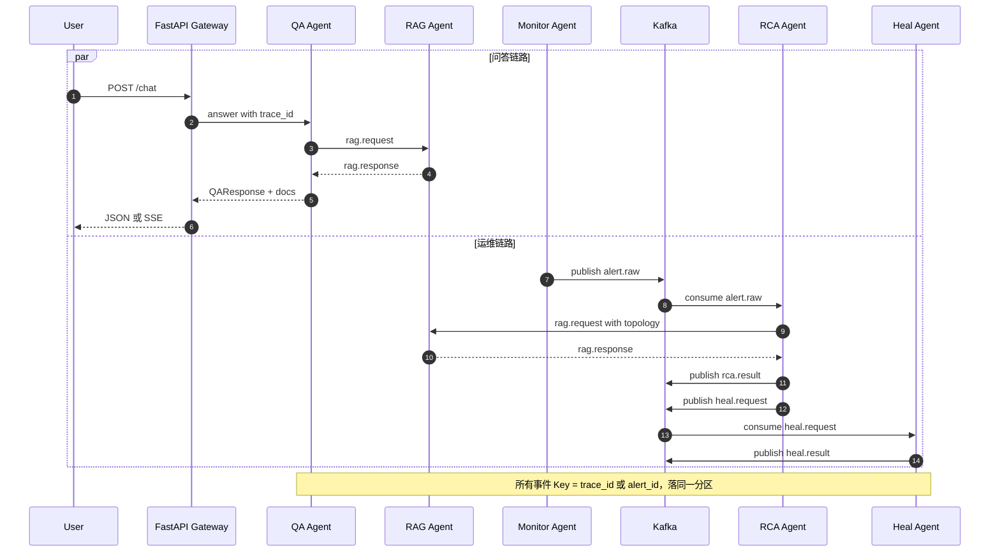

### 5.2 自适应 RAG 检索

检索质量决定了回答质量。针对不同类型的问题直接用同一套检索策略是次优的——问答类问题追求召回覆盖面，资源告警类问题关心量化指标手册，日志错误类问题则需要精确命中关键字。因此系统在检索入口加了一个规则路由器 `RuleRouter`，通过正则将查询分为 `QA / RESOURCE_ALERT / LOG_ERROR` 三类，再按类别分别加载不同的检索策略。

检索主干是语义 + 词法的混合：语义通路基于 bge-m3 的 embedding 做 ANN（优先 Milvus，缺失时降级为内存余弦），词法通路基于 rank-bm25 + jieba。两路结果经 **Reciprocal Rank Fusion** 合并，公式为 `score(d) = Σ w_i / (k + rank_i)`，`k` 默认取 60，权重 `w_i` 在不同查询类别上不同：问答类两路等权，资源告警类 BM25 权重设为 0（关闭词法以避免手册内噪声误命中），日志错误类则把 BM25 权重抬高到 1.0、语义权重压到 0.3（因为日志类查询的关键词字面命中比语义相似更重要）。融合后的 Top-K 进入 bge-reranker-v2-m3 做最终重排，取 Top-N=5 输入到 LLM。

为了降低在线延迟与成本，在整个 RAG 之上套了一层**语义缓存**，基于 Redis Stack 的 RediSearch + HNSW：每次查询先用 embedding 去索引里找最近邻，若余弦距离低于 `0.08` 阈值则直接返回已缓存的 `RAGResponse`，TTL 默认 1 小时。由于缓存键是向量而非字符串，"CPU 为什么飙高"与"CPU 过高原因"这种语义等价的问题可以共享一条结果。

**RAG 自适应检索流程：**

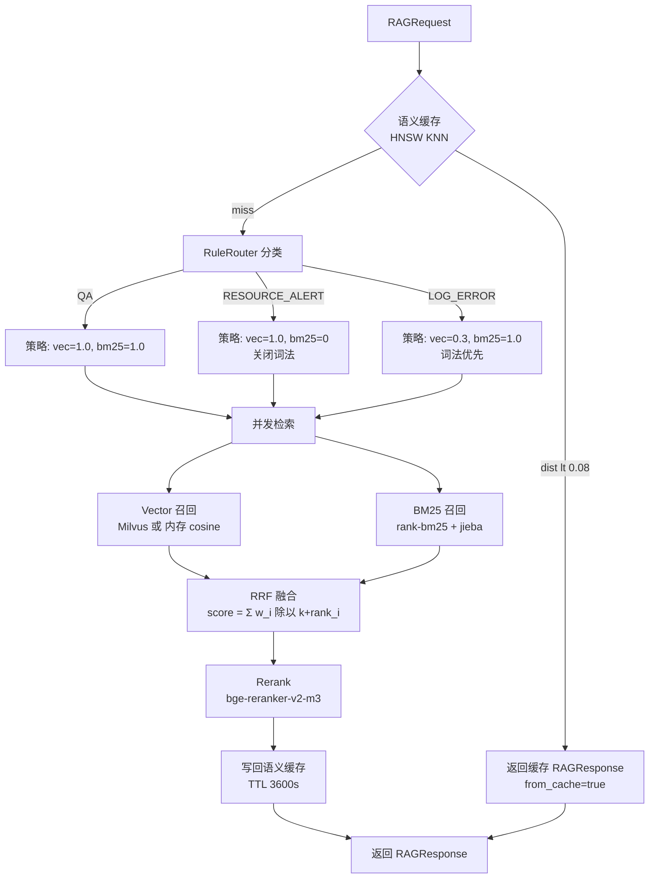

### 5.3 短期记忆与长期记忆

记忆分两层。**短期记忆**解决的是单次对话的上下文限制：采用"滑动窗口 + 异步增量摘要"机制，窗口大小默认 10 轮，持久化在 Redis 的 `mem:short:{session_id}` 键下。当新消息挤出窗口时，被挤出的消息由 `asyncio.create_task` 投递到后台协程，由 LLM 基于"旧摘要 + 被挤出的对话"生成新的摘要，并合并回 session 状态。这样主路径不会因为摘要被阻塞，但随着会话进行，上下文又始终保持"完整的近 10 轮 + 一段压缩的历史精华"。

**长期记忆**负责跨会话的用户画像与偏好。每轮对话结束后（同样异步），系统让 LLM 从本轮对话中抽取最多 5 条事实性偏好，例如"用户主要关心 chip-worker 的稳定性"或"倾向简短回答"，然后将其 embedding 写入 Milvus 的 `user_profile` 集合，并按 `user_id` 做元数据过滤。QA 在生成回答前会把用户画像一并加入 Prompt 上下文，使得回答个性化。两层记忆相互独立，彼此通过 `session_id` / `user_id` 做隔离。

**短期记忆状态流转（滑动窗口 + 异步摘要）：**

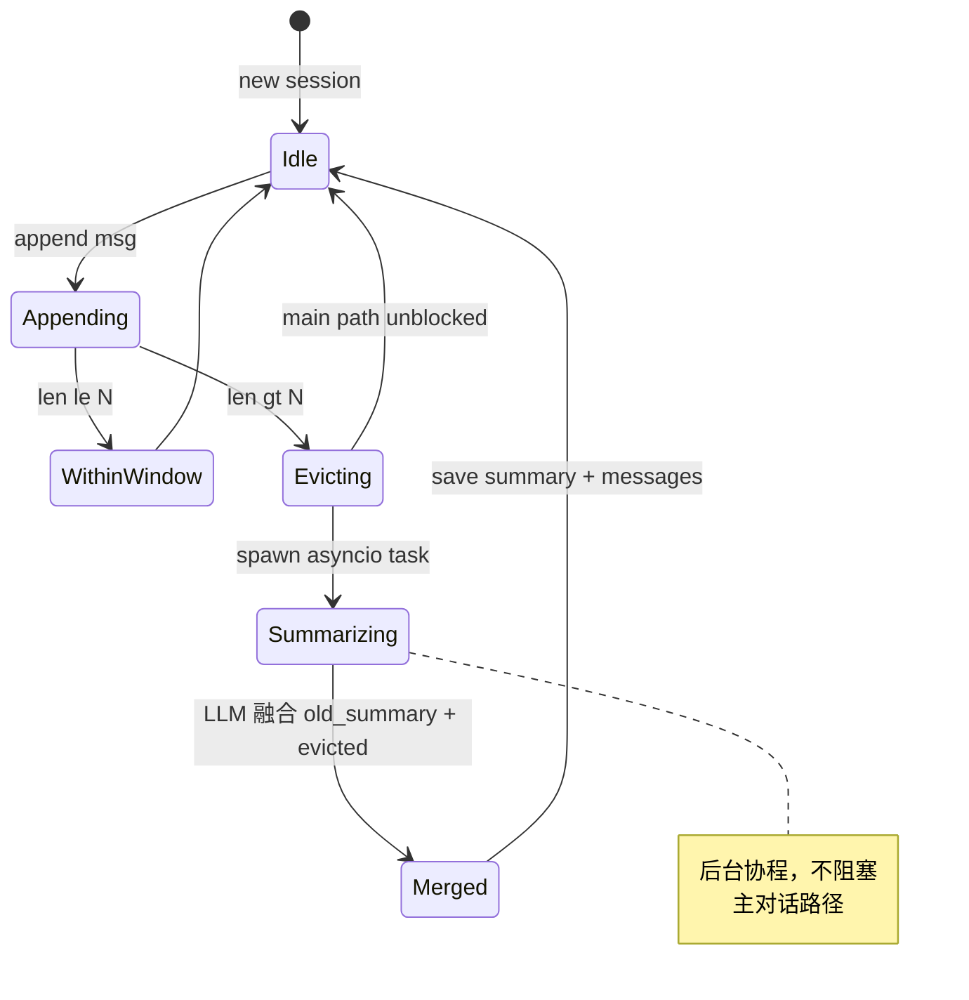

**长期记忆写入/召回流程：**

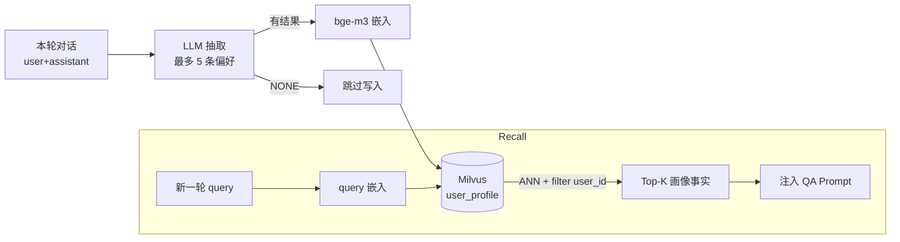

### 5.4 监控告警

监控 Agent 面向两种异常源。**指标类异常**采用 3-Sigma 与 EWMA 双算法投票：3-Sigma 基于滑动窗口（默认 60 点）的均值和标准差判断偏离，对突发尖峰敏感；EWMA（α=0.3）对趋势性漂移敏感。任一算法命中即判为异常（OR 投票），兼顾灵敏度与覆盖面；当两者同时命中则在告警 `detected_by` 字段标为 `vote`，置信度更高。投票制避免了单一算法在不同业务指标上的偏见。

**日志类异常**走正则规则，规则集来自 `configs/settings.yaml` 的 `monitor.log_rules`，每条规则配置 `pattern` 与 `severity`。这一通路的好处是可解释、可运营——SRE 可以直接配置"panic|fatal → P1"这样的规则并立即生效，不需要重新训练模型。日志扫描周期默认 30 秒，扫到命中立即产出 `AlertEvent`。

两类检测器产生的 `AlertEvent` 通过 `alert.raw` Topic 汇入同一条下游链路，RCA Agent 无需区分告警源头。

**指标检测 3-Sigma / EWMA 投票流程：**

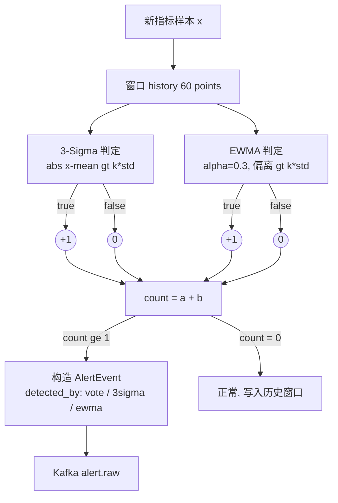

**日志检测流程：**

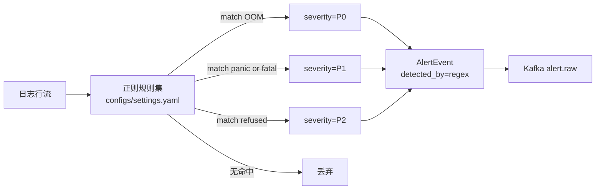

### 5.5 根因分析

根因分析是整个系统的"推理中枢"。单纯让 LLM 看着一条告警"凭空"判断根因是不可靠的，需要给它喂足够的上下文。系统的做法是**图谱 + RAG + LLM 三位一体**。

首先从 Neo4j 拉取告警服务的一跳上下游子图：`(:Service)-[:DEPENDS_ON|USES]->(:Service|:DB)`。这部分图谱是离线维护的静态知识，反映微服务的调用关系与数据依赖。然后把告警本身（服务名、指标、超阈程度）和子图节点拼装成一个描述性查询，发给 RAG 管道，命中相关知识（故障处置手册、历史工单）。最后把告警、子图、RAG 结果一起填入 `rca.jinja` 模板，让 LLM 输出一段结构化 JSON，包含 `root_cause_service`、`reasoning`、`suggested_actions` 三个字段。

这样做的关键在于：**图谱提供因果先验**（"告警服务 A 依赖 B 的数据库，B 的慢查询会传染给 A"），**RAG 提供经验先验**（"去年类似指标飙升的处置方法"），**LLM 把这些先验融合成自然语言结论**。每一步都有降级路径：Neo4j 不可用时用内置 mock 拓扑，RAG 不可用时只给图谱 + 告警，LLM 不可用时（离线模式）回退到"根因等于告警服务本身、动作等于 restart_pod"的保守策略。

**根因分析推理时序：**

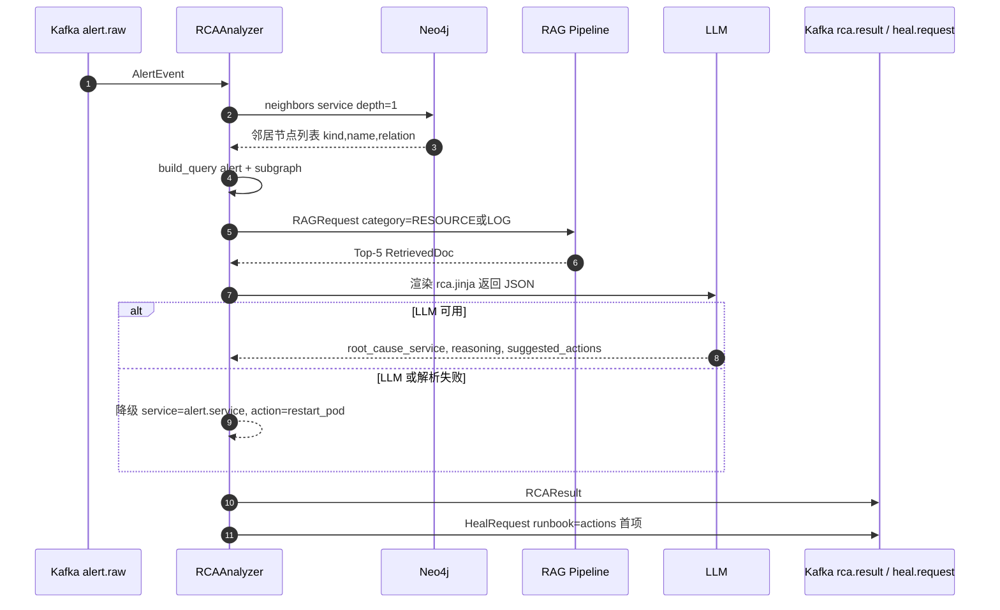

### 5.6 故障自愈

自愈 Agent 消费 `heal.request`，加载对应名字的 YAML Runbook 并按 `steps` 顺序执行。Runbook 中的每一步都支持 Jinja2 参数渲染，例如 `kubectl -n {{ namespace }} rollout restart deploy/{{ service }}` 会在运行时被填充为具体命令。

出于安全考量，执行层默认只放行前缀为 `echo` 的"模拟命令"——这保证了在 demo/测试场景下整个链路端到端可跑通，但不会在开发者本机误伤真实集群。**生产环境需要显式放开允许执行的命令白名单**，并建议把 Runbook 执行放到独立的、权限隔离的执行节点（比如 Kubernetes Job + ServiceAccount），而不是和 Agent 同进程。

**Runbook 执行流程：**

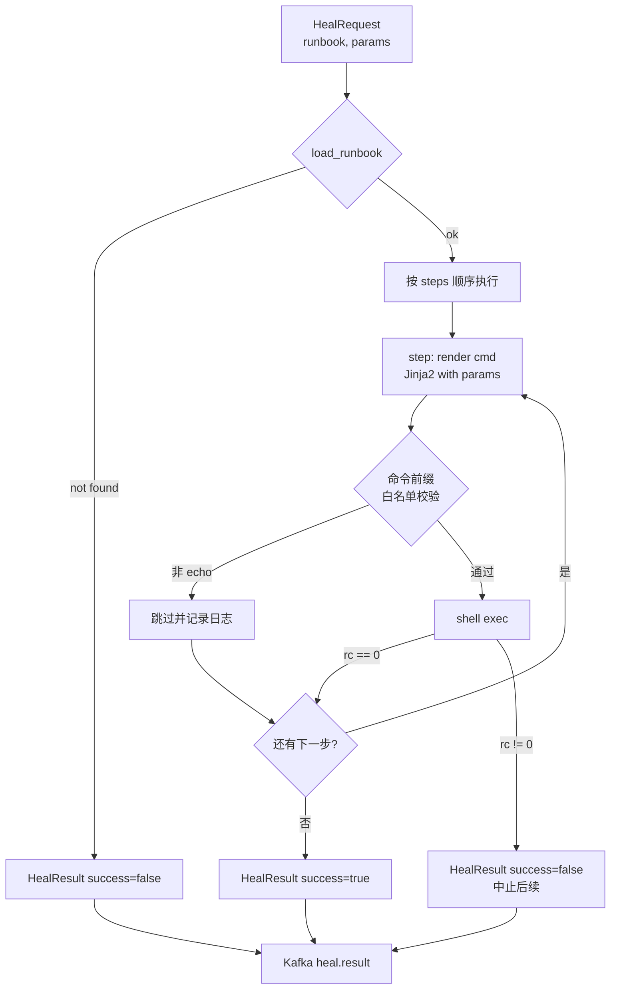

### 5.7 高可用保障

在面向 LLM、Milvus、Neo4j、外部 HTTP 的所有调用上，都叠加了"熔断 + 重试"两层防护。**熔断器**采用标准三态（CLOSED / OPEN / HALF_OPEN）实现：连续失败达到阈值（默认 5）切换到 OPEN，快速失败保护下游；经过 `recovery_timeout`（默认 30 秒）后进入 HALF_OPEN，放行 1 个探测请求；探测成功则恢复 CLOSED，失败则立刻回到 OPEN。这避免了故障下游被持续打爆。

**重试策略**做了差异化。LLM 调用 3 次重试、指数退避 + 抖动（因为 LLM 速率限制是瞬时态）；DB 调用 5 次重试、固定 0.5 秒间隔（因为连接错误常是瞬态）；Kafka Producer 无限重试、指数退避上限 30 秒（因为消息不能丢）；HTTP 调用 3 次、较短退避（避免放大故障）。这四类策略通过 `retry_policy(kind)` 工厂函数暴露，业务代码只需 `@retry_policy("llm")` 即可。

两层机制互补：熔断避免"对已经挂了的依赖继续重试"，重试则处理"真正的瞬态抖动"。结合上 Kafka 的天然削峰和 Agent 的水平扩容，可以在极端场景（例如 LLM 区域性故障、Milvus 节点抖动）下保持核心对话链路的可用性——最差情况下走到 LLM 离线回退或本地向量 fallback，但不会整个服务宕机。

**熔断器三态转换：**

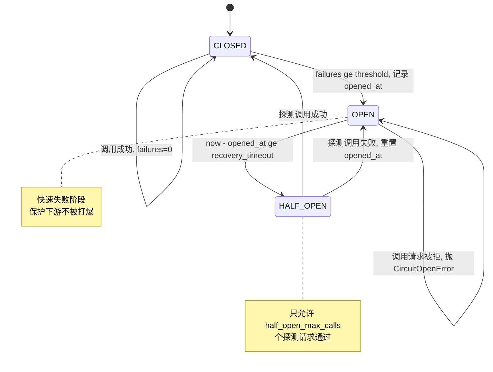

**差异化重试策略（调用方式）：**

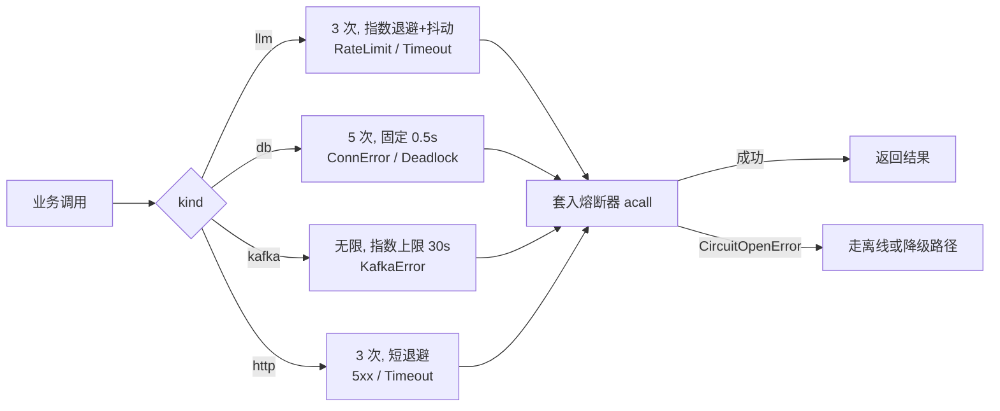

### 5.8 质量评估

Agent 系统的难点不在"跑起来"而在"持续跑对"。系统构建了端到端的评估轨道。**在线**：每个关键阶段（QA 生成、RAG 检索、RCA 推理）都通过 `Tracer.emit()` 向 `eval.trace` Topic 写入结构化的 `EvalTrace`，包含阶段名、输入输出摘要、延迟、附加元数据。这些 trace 可以实时接入到 Kafka 下游的分析/存储系统（ClickHouse、Elasticsearch 等）做在线监控。

**离线**：搭建了两套评估指标。一是**自研轻量指标**：幻觉率（答案 token 与检索上下文 token 的重叠率低于阈值视为幻觉）、回答准确率（是否包含黄金集关键信息）、recall@k 与 MRR（针对标注数据集）。二是接入 **RAGAS**：`faithfulness`（答案是否忠实于上下文）、`answer_relevancy`（答案是否回应了问题）、`context_precision`（检索上下文的精度）、`context_recall`（检索上下文的召回）。推荐的持续集成门槛是 `faithfulness ≥ 0.80`、`context_recall ≥ 0.75`；不达标则在 CI 中标红，阻止发布。

评估样本管理在 `data/eval.jsonl`，每条样本包含 `question / answer / contexts / ground_truth`。随着线上 `eval.trace` 的积累，可以定期挑选出有代表性的样本补充到评估集里，形成"线上反哺线下"的闭环。

**在线 + 离线评估闭环：**

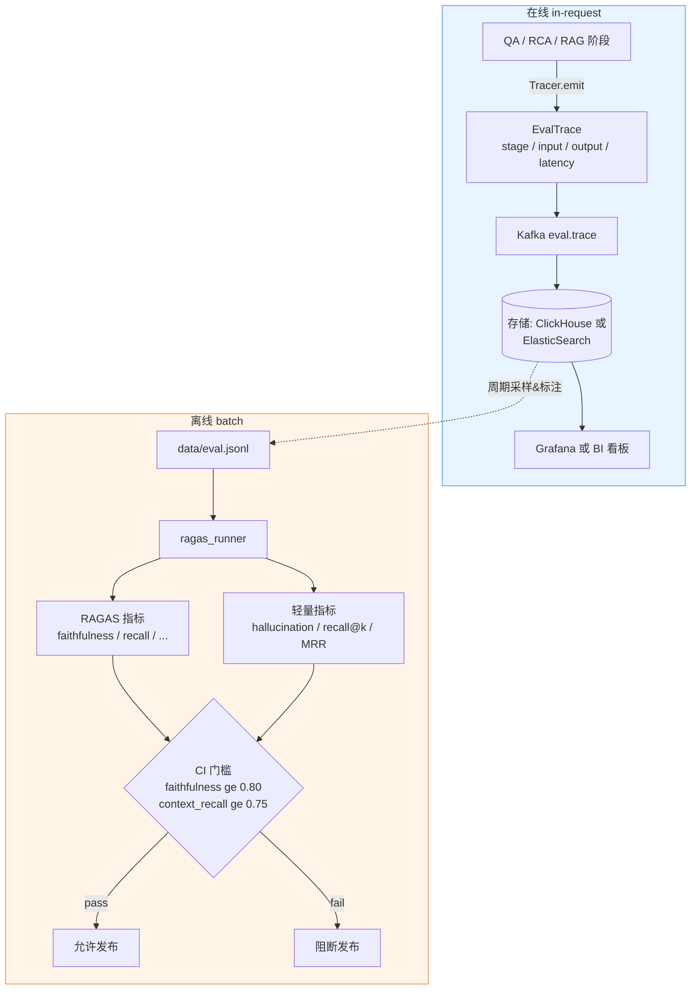

---

## 6. 关键时序流程

**问答时序**：用户调用 `/chat` → Gateway 生成 `trace_id` 并调用 `QAAgent.answer()` → LangGraph 依次执行 `load_memory`（读 Redis 摘要 + 近期消息、读 Milvus 用户画像）→ `classify`（规则路由器定类别）→ `retrieve`（调 RAG 管道：语义缓存命中或走混合检索 + RRF + Rerank）→ `generate`（填模板、调 LLM）→ `update_memory`（回写 Redis，异步更新用户画像）→ 返回 `QAResponse`。整个链路每一步都 `with log.contextualize(trace_id=...)`，日志可全链路追踪。

**运维时序**：Monitor Agent 的后台协程定期拉取 CPU 指标 → `AnomalyDetector.vote(x)` 判异 → 构造 `AlertEvent` 发布到 `alert.raw` → RCA Agent 消费，先从 Neo4j 取邻居拓扑，再调 RAG 找相关经验，最后让 LLM 输出 JSON 根因 → RCA Agent 把 `RCAResult` 发到 `rca.result`，把 `HealRequest` 发到 `heal.request`（runbook 名取自 `suggested_actions[0]`）→ Heal Agent 消费、加载 YAML渲染每一步命令并执行 → 把 `HealResult` 发到 `heal.result`。一次事件产生的所有消息共享同一 `alert_id`，可在 Kafka 里完整串起全链路。

---

## 7. 非功能设计

整套系统遵循 async-first 的原则，避免在核心路径上出现阻塞调用。外部连接的初始化集中在 FastAPI 的 `lifespan` 中，避免模块加载期产生副作用。配置采用 YAML + 环境变量双层覆盖，机密仅从环境变量读取，不写入代码仓库。日志统一结构化并带 `trace_id`，方便被 Loki / Elasticsearch 收集后跨服务聚合。所有外部依赖（Kafka/Milvus/Neo4j/Redis/Rerank/Embedding）都实现了**本地降级路径**，确保在任一组件缺失时仍可运行 demo，这一特性在开发和 CI 场景下极大地降低了环境门槛。

部署形态使用 Docker Compose 统一编排。生产环境推荐将 Agent 按副本数独立部署，Kafka 保留至少 3 broker 以获得副本保障；Milvus 选择 cluster 模式并挂持久卷；Neo4j 启用企业版的 HA 或者至少配置周期快照。监控接入 Prometheus + Grafana 读取应用自身暴露的 `/metrics`，并通过 `eval.trace` Topic 把 Agent 的质量指标接入到 BI 看板。完整的可观测矩阵由"日志 + 指标 + 质量指标 + 链路追踪"四部分组成，与业务侧的芯片缺陷数据互为交叉参考，最终形成"一个告警既能看到系统异常，也能看到对 Agent 自身回答质量的影响"的全景视图。

---

## 8. 快速开始

### 8.1 启动基础设施（Docker）

```bash
# 一键启动：Kafka / Redis-Stack / Milvus / Neo4j
bash scripts/setup.sh up

# 查看状态
docker compose ps

# 停止
bash scripts/setup.sh down
```

> Kafka 使用 `apache/kafka:3.7.0` 的 KRaft 模式（无 Zookeeper）。容器内部通过 `kafka:29092` 互访，宿主机脚本走 `localhost:9092`。

### 8.2 配置环境变量

```bash
cp .env.example .env
# 编辑 .env 填入 LLM API Key
```

### 8.3 本地安装依赖

```bash
pip install -e ".[dev]"
```

### 8.4 初始化数据

```bash
# Neo4j 拓扑
python scripts/init_neo4j.py

# Milvus collection
python scripts/init_milvus.py

# 写入样例知识
python scripts/seed_knowledge.py
```

### 8.5 启动服务

```bash
# 方式 A：直接本地
uvicorn aiops.main:app --reload --port 8000

# 方式 B：完整 compose（含 app 容器）
docker compose up -d
```

### 8.6 跑 Demo

```bash
# 问答 Demo
python examples/chat_demo.py

# 告警 -> 根因 -> 自愈 Demo
python examples/alert_demo.py
```

---

## 9. 测试

```bash
pytest tests/unit -v
pytest tests/integration -v  # 需要 compose 已启动
```

---

## 10. 评估

```bash
python -m aiops.eval.ragas_runner --dataset data/eval.jsonl
```
